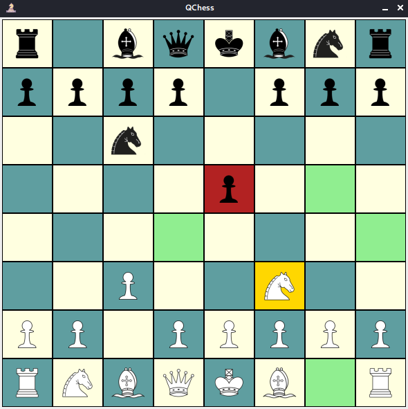

# QChess

***QChess*** — Клиент-серверные шахматы, написанные на Java. Буква Q в названии означает Quick —
быстрый, находчивый.

Приложение поддерживает все возможности, описанные в
правилах [Фиде 2020 года](https://moscowchess.org/stat/files/FIDE-arbierts-instruction-2020.pdf), в
числе которых:

1. Стандартные движения фигур
2. Длинная и короткая рокировки
3. Взятие на проходе
4. Продвижение пешки
5. Завершение игры

**Пат** ставится в том случае, если у игрока нет возможности сделать ни одного корректного хода.

**Мат** присуждается, если игрок не может сделать ни одного хода, при этом его король под шахом.

Ничья автоматически ставится при:

1. Невозможности выигрыша из-за **нехватки материала** для мата — король против короля, король
   против короля с конём, король против короля со слоном, король со слоном против короля со слоном
   при однопольных слонах.
2. **5-ти кратном повторении** позиции на доске ~~(при 3-х кратном — предложение ничьи)~~
3. **75 ходах** без взятий и хода пешки ~~(при 50-ти ходах — предложение ничьи)~~

## Боты

1. `RandomBot` — выбирает случайные ходы из списка доступных.
2. `AttackBot` — отдаёт приоритет ходам-взятиям. Не пытается ставить шах
3. `MinimaxBot` — оценивает все возможные ходы, сделанные любым игроком, до определенного уровня
   глубины. Чем выше значение оценки, тем более выгодна позиция для белых и чем ниже значение
   оценки, тем более выгодно позиция для черных. Зная, что белые будут пытаться увеличить счет, а
   черные будут пытаться снизить счет, ИИ предполагает лучшую игру с любой стороны, проходя вверх по
   дереву поиска и выбирая лучший ход для игры. Проблема, которая может возникнуть, — это количество
   позиций, которые необходимо оценить. Даже на трех уровнях глубины необходимо оценить тысячи
   позиций. В этой программе используются несколько методов для уменьшения числа поисковых позиций:
    1) Альфа-бета отсечение — в результате оценки позиции можно обнаружить, что часть дерева поиска
       можно игнорировать, поскольку никакие дальнейшие оценки не могут гарантировать лучшие
       результаты. Таким образом, для белых было бы разумно игнорировать любую часть дерева, где у
       черных есть явный перевес, который они могут применить в игре.
    2) Матрицы ценности фигуры, в зависимости от положения на доске — позволяют выбрать наилучшее
       положение своих фигур, оттесняя вражеских в невыгодное положение. Например, ценность коня на
       краю доски падает, а ценность пешки по приближении к противоположной стороне растёт.
    3) ~~(лучшие оценки, например, учитывать сдвоенные пешки и запертого слона)~~
    4) ~~(порядок перебора ходов при поиске. Эвристика "убийцы", "Нулевой ход")~~
    5) ~~(тут про хэширование сказать, которого нет)~~
    6) ~~(метод Монте-Карло)~~
    7) ~~(база дебютов)~~
    8) ~~(база эндшпилей)~~
    9) ~~(Хэш-ключи Зобриста)~~
    10) ~~(Principal Variation, Futility Prunning, Razoring и т.п.)~~

## Интерфейс

# Компиляция

1. В корне проекта выполнить команду: `mvn package`
    - Можно добавить флаг `-DskipTests`, чтобы пропустить тесты
2. В папке *core/target/* выполнить: `java -jar QChess-core-0.0.1-jar-with-dependencies.jar`
3. Ввести `s`, если вы хотите запустить сервер или `c`, чтобы запустить клиент.

Также в других папках лежат отдельные модули проекта:

- **QChess-client**

Тут лежит модуль для запуска только клиента.

- **QChess-server**

Тут лежит модуль для запуска только сервера.

- **QChess-core**

Отсюда можно запустить и сервер, и клиент.

- **QChess-client-server-conversation**

Это дополнительный модуль. В нем лежат классы, с помощью которых клиент и сервер обмениваются
информацией.

- **QChess-game**

Это дополнительный модуль - движок игры. В нем лежат классы самой игры.
